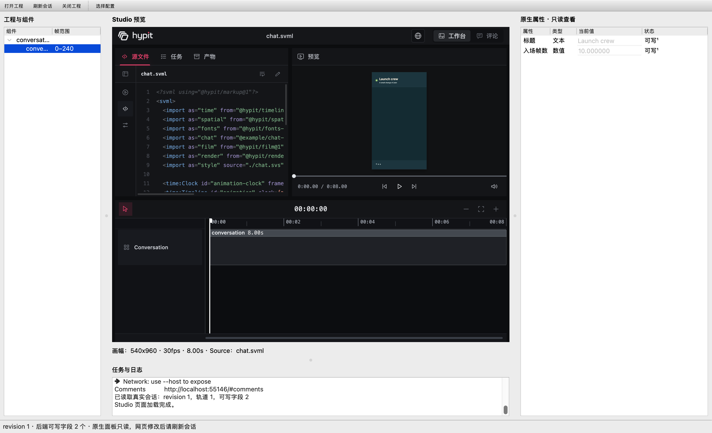

# Qt 视频创作工作台

Qt 6 Widgets 桌面应用。**当前已完成 M1/G1：从 Qt 打开本地视频工程、自动启动 Studio、读取真实会话、显示视频预览并安全关闭所属进程。**

应用自己的原生属性面板目前只读；工程存储、素材管理、原创模板、原生写回和应用内导出编排是后续里程碑。完整进度见 [STATUS.md](STATUS.md)。

## 构建与启动

本机已验证 macOS 15.7.7 arm64、Qt 6.11.2（Core/Gui/Widgets/Network/WebEngineWidgets/Test）、CMake 4.4.3、Node 22.22.1、Hypit 0.2.10。

```bash
cmake -S . -B build -DCMAKE_PREFIX_PATH=/opt/homebrew/opt/qt
cmake --build build -j4
./build/app/qt-video-workbench
```

启动后点击“打开工程”，选择 `.svrun`、工程目录和本地 Runtime JSON。主窗口显示工程组件、完整 Studio 预览、原生只读属性和日志。选择组件可查看其属性；网页修改后点击“刷新会话”。“关闭工程”或关闭窗口会停止该窗口创建的 Studio。

也可直接打开官方本地示例：

```bash
./build/app/qt-video-workbench \
  --workspace=../hypit/examples/semantic-composition \
  --run=../hypit/examples/semantic-composition/chat.svrun \
  --runtime=../hypit/examples/semantic-composition/hypit.runtime.json \
  --log=.workbench/workbench.jsonl
```

官方 chat 示例默认不带可写属性 Companion。验证原生面板的两个字段可使用下方真实集成脚本生成的工作副本。

## 配置与边界

`config/version-lock.json` 固定 Hypit 版本。`hypit.distributionPath` 相对仓库根目录解析，默认 `../hypit`；`launcher` 相对 Distribution 解析。可传 `--config=<版本锁文件>` 或从工具栏“选择配置”切换，配置保持在 `<repo>/config/` 布局下。

日志默认写入 Qt AppDataLocation 的 `workbench.jsonl`，也可用 `--log` 指定。每条记录是独立 JSON，命令使用 program、arguments 数组和 exitCode 字段，中文、空格和换行不会破坏记录边界。

启动时检查实际 Hypit 版本；不匹配会显示可读错误。当前接受的 Runtime 为 `hypit.runtime-local@1`，Provider 仅限 `@hypit/provider-media-local` 与 `@hypit/provider-hyperframes-local`。

Qt 通过自己的 QProcess 管理 Studio，通过 QNetworkAccessManager 读取原始 Snapshot。Hypit 的编译、渲染和 Studio 界面是上游能力；本项目不把上游复制进仓库。原生 UI 使用归一化 DTO。

## 验证与截图

```bash
ctest --test-dir build --output-on-failure
python3 tests/integration/cli_cases.py
python3 tests/integration/live_studio.py
```

真实集成测试需要原生窗口与本机监听权限，会创建含中文和空格的独立工程副本、占用请求端口检查回退、读取真实会话和预览、关闭窗口并确认不误杀无关进程。结果与截图写入 [docs/evidence/m1-live/](docs/evidence/m1-live/)。



原有离线模式也保留，两种参数形式（等号或空格）均有效：

```bash
./build/app/qt-video-workbench --selftest --out=/tmp/qvw.png \
  --session=docs/evidence/m1/session_with_writable_fields.json
```

退出码：0 成功；1 未知/无法解析的参数；2 参数组合无效；3 会话文件或截图读写失败；4 配置/日志错误；6 Studio/版本/HTTP/页面失败；7 清理失败；8 真实预览超时。常规交互模式的错误留在窗口中供用户修正。

## 代码结构

```text
app/
  domain/          Snapshot、InspectorField 与控件类型
  backend/hypit/   StudioProcess、StudioClient、SnapshotMapper
  infrastructure/ 配置、异步版本检查、JSONL 日志
  controllers/     ProjectController 会话生命周期
  ui/              Qt 四区域主窗口、原生属性只读控件
config/            依赖版本锁
probes/qt-webengine/  M0 HTTP/预览/媒体探针
tests/unit/        配置、进程、HTTP、版本与控件测试
tests/integration/ 参数回归与真实 Studio 验收
docs/evidence/     历次真实证据
```

实现与接口限制见 [PROJECT_PLAN.md](PROJECT_PLAN.md)、[tasks.json](tasks.json)、[docs/API_CONTRACT.md](docs/API_CONTRACT.md)。Hypit 的 LICENSE 含附加条件，按固定版本保留与复核，详见 PROJECT_PLAN §10。
