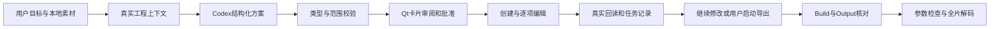

# Agent 创作流程与执行边界

本地图片和自然语言通过当前 Codex 登录生成可审阅方案。Qt负责工程事实、批准、执行和任务保存；Hypit0.2.10负责固定的视频语言、编译、Studio和渲染。模型不直接编辑源码。

## 方案和事实

`qvw.agent-plan@1`只接受create/edit/clarify三种行为。创建只使用安装的原创story-reel模板，三段可排序、可调整数帧；文字、图片、颜色和字号经真实参数编辑进入工程。编辑至多24项，只用实际Snapshot暴露的可写字段与已登记素材。缺少素材、指代不清或要求冲突时应返回澄清。

ContextBuilder发送名称、尺寸、ID、字段类型和值、场景跨度及用户声明范围，不发送图片像素或所选原图路径。实际compiled entity ID可能包含本地工程URI，它是定位真实属性的必要标识。模型不能据此调用文件、Shell或网络。

`selectedEntity`表示Qt实际选中的组件，用于理解“这个组件”；`editScope`表示下一次请求的授权范围。选择轨道或清空选择时不保留旧组件。每个任务在生成时固定自己的范围，等待模型、执行、失败重试或暂停期间的导航仅影响未来请求；已有任务的显示、批准和保存范围保持一致。

请求使用独立临时目录、stdin和schema；关闭用户配置、规则、工具、记忆与历史写入，观察到工具事件即拒绝结果。该设置不是对管理员注入工具的绝对隔离证明。应用不打开或复制凭据，认证由Codex CLI持有。初次启动与配置重载均将应用的工具环境交给ModelClient，支持使用env查找Node的CLI入口，不改全局PATH。超时、取消、畸形/超限输出、非零退出和旧回调均不能产生可批准成功结果。

## 批准和顺序执行

程序保存请求时工程根、revision、源码SHA及范围。批准身份由完整方案及这份基线的SHA生成；模型没有批准字段。所有操作先整份校验，再逐项沿Document/Editor/ExportController执行。

每个参数编辑经版本预检、真实写入、版本和字段回读后才计入成功。Hypit目录watcher可能在自己的写入后迟到并重发同一源码；Agent每个已确认写入和撤销后做两次间隔150ms的只读刷新，只允许同一源码指纹更新revision。外部源码变动停止剩余动作，409不自动重放。刷新读到相同源码的revision重发保留共享撤销历史；其他冲突规则保持严格。

进度是实际已确认条数。失败保留成功前缀，在相同指纹和仍有效批准下只重试未完成步骤，每步最多两次。停止后续不回滚已完成内容；撤销使用同一Editor历史的一步。模型可依据真实失败和当前事实提出修订，修订仍需新批准。

## 保存与导出

工程源码是视频内容的权威事实。任务JSON和有界追加事件保存在`.workbench/agent/`，使用原子保存及跨进程锁，目录和文件都拒绝符号链接、特殊文件。保存失败会停止后续写入。恢复等待当前工程的真实Snapshot，匹配才可重新批准剩余步骤；过期基线保持原样，连续恢复不会把旧方案变成当前方案。损坏记录显示失败并保留原文件。创建新工程时执行记录立即切换到新根路径，在实际编译前保持未知版本与指纹，不沿用旧工程的范围或快照。

导出由用户明确选择路径，复用输入冻结、真实Build ID、精确Output获取和媒体验证。HTTP接受、CLI退出、Build完成、Output获取及全片可解码分别核对。旧产物按源码指纹标为过期；媒体检查不替代视觉与文案审阅。

## 已核对的契约

- 固定Hypit commit：`1af179d3f58284c2d6d3c1f63052172a4fe1b5a6`。
- `packages/studio/src/shared.ts:99`：authoredId与完整compiled id不同，程序写入仍用后者。
- `packages/studio/src/server.ts:109–117,182,445`：目录watcher、80ms调度和提交版本保护。
- `packages/temporal-markup/src/index.ts:25–52`：组件程序时间参数。
- 可视预览源码在`shared.ts:286`、`session.ts:106`和`ui/stage.ts:345–371`；编译Snapshot不能独自证明画面已载入。
- Codex官方说明：[结构化非交互输出](https://learn.chatgpt.com/docs/non-interactive-mode#create-structured-outputs-with-a-schema)、[CLI参考](https://learn.chatgpt.com/docs/developer-commands)、[配置参考](https://developers.openai.com/codex/config-reference)。实际使用参数由本机0.159.2 help和真实请求核对。

原始失败、修复和最终验收见[证据索引](evidence/m8/README.md)。
